# C4 — Diagrama de Componentes (Nível 3)

> Gerado pelo Arquiteto (Reversa) em 2026-05-16
> Referência: C4 Model — https://c4model.com
> Foco: Container **Backend API** (componente mais complexo e central)

---

## Descrição

Este diagrama detalha os componentes internos do **Backend API** — o orquestrador central do Agente Zap. Cada componente corresponde a um módulo com seus controllers, services e models.

---

## Diagrama Mermaid — Backend API

```mermaid
C4Component
    title Componentes do Backend API — Agente Zap

    Container_Boundary(backend, "Backend API (Node.js/Express :3302)") {

        Component(index, "App Entry (index.ts)", "Express + Socket.IO bootstrap", "Registra rotas, inicializa middlewares, inicia background jobs e reconecta sessões ao startup")

        Component(auth_mod, "Auth Module", "JWT + bcrypt", "Registro e login de usuários. Middleware authenticateToken valida JWT em todas as rotas protegidas")

        Component(whatsapp_mod, "WhatsApp Module", "whatsapp-web.js + Puppeteer + Singleton", "Gerencia sessão WhatsApp (QR, connect, disconnect). WhatsAppManager garante uma instância por usuário. Keep-alive a cada 15 min")

        Component(conv_mod, "Conversation Module", "Pipeline de mensagens", "Processa mensagens recebidas: verifica auto-resposta, envia mídias obrigatórias, chama RAG, gera resposta, extrai/executa comandos inline")

        Component(rag_service, "RAG Service", "LangChain + ChromaDB + re-ranking híbrido", "Busca semântica com re-ranking: 0.5×keyword + 0.3×vector + 0.2×priority. Timeout de 60s. Normaliza query em PT-BR")

        Component(ollama_mod, "Ollama Module", "HTTP keep-alive + @langchain/ollama", "Interface com LLM local. Gera embeddings e respostas de texto. HTTP keep-alive (maxSockets=5). keep_alive=5min no modelo")

        Component(doc_mod, "Document Module", "multer + pdf-parse + mammoth + chunker", "Upload de arquivos (PDF/DOCX/TXT, max 10MB). Extração de texto e divisão em chunks de 1000 chars para indexação")

        Component(indexing_mod, "Indexing Module", "ChromaDB SDK", "Reindexação de toda a base de conhecimento (docs + tópicos + mídias). Gerencia coleções user_{userId} no ChromaDB")

        Component(media_mod, "Media Module", "multer + ChromaDB", "Upload e gestão de mídias. Flag mandatory_send dispara envio automático em toda nova interação")

        Component(topic_mod, "Topic Module", "ChromaDB + JSON keywords", "Tópicos com keywords JSON, prioridade e contexto. Indexados no ChromaDB para uso no RAG")

        Component(agent_config_mod, "AgentConfig Module", "MariaDB", "Configuração do agente por usuário (único): modelo LLM, textos do negócio, parâmetros de geração")

        Component(human_att_mod, "HumanAttendant Module", "WhatsApp sendMessage", "Gerencia lista de atendentes humanos. Envia alertas WhatsApp quando IA solicita [ALERTA_ATENDENTE]")

        Component(vmlav_mod, "VmLav Module", "Puppeteer + axios + scheduler", "Integração com VM Lavanderia: autenticação via browser scraping, sync a cada 10min de clientes/pedidos/vouchers")

        Component(fidelizacao_mod, "Fidelizacao Module", "Motor de regras + anti-spam", "Programa de fidelidade por pontos. Motor de automações com gatilhos, vigência e 3 camadas anti-spam. Geração automática de vouchers")

        Component(test_chat_mod, "TestChat Module", "RAG + Ollama", "Endpoint de teste do pipeline RAG sem envio real pelo WhatsApp. Retorna logs de busca e geração")

        Component(schedulers, "Background Schedulers", "setInterval", "4 jobs: finalização de conversas (1h), health check WhatsApp (30min), sync VM Lav (10min), automações fidelidade (sob demanda)")
    }

    ContainerDb(mariadb, "MariaDB :3306", "")
    ContainerDb(chromadb, "ChromaDB :8000", "")
    System_Ext(whatsapp_ext, "WhatsApp Web", "")
    System_Ext(ollama_ext, "Ollama :11434", "")
    System_Ext(vmlav_ext, "VM Lav API", "")
    System_Ext(whisper_ext, "Whisper Service", "")

    Rel(index, auth_mod, "Registra middleware")
    Rel(index, whatsapp_mod, "Inicializa e reconecta sessões")
    Rel(index, schedulers, "Inicia jobs de background")

    Rel(conv_mod, rag_service, "Busca contexto relevante")
    Rel(conv_mod, ollama_mod, "Gera resposta de texto")
    Rel(conv_mod, media_mod, "Envia mídias obrigatórias")
    Rel(conv_mod, human_att_mod, "Envia alerta de intervenção")
    Rel(conv_mod, whatsapp_mod, "Envia mensagem de resposta")

    Rel(rag_service, chromadb, "Busca por similaridade vetorial")
    Rel(rag_service, ollama_mod, "Gera embedding da query")

    Rel(doc_mod, chromadb, "Insere chunks indexados")
    Rel(doc_mod, ollama_mod, "Gera embeddings dos chunks")
    Rel(indexing_mod, chromadb, "Gerencia coleções por usuário")
    Rel(topic_mod, chromadb, "Indexa tópicos")
    Rel(media_mod, chromadb, "Indexa mídias")

    Rel(whatsapp_mod, whatsapp_ext, "Controla sessão (Puppeteer)")
    Rel(whatsapp_mod, conv_mod, "Entrega mensagem recebida")
    Rel(human_att_mod, whatsapp_mod, "Solicita envio de alerta")

    Rel(vmlav_mod, vmlav_ext, "Autentica e sincroniza dados")
    Rel(fidelizacao_mod, vmlav_mod, "Consulta pedidos e gera vouchers")
    Rel(fidelizacao_mod, whatsapp_mod, "Dispara mensagens de marketing")

    Rel(ollama_mod, ollama_ext, "HTTP REST")
    Rel(conv_mod, whisper_ext, "Transcreve áudio recebido")

    Rel(auth_mod, mariadb, "users")
    Rel(whatsapp_mod, mariadb, "whatsapp_sessions")
    Rel(conv_mod, mariadb, "conversations, messages")
    Rel(doc_mod, mariadb, "documents, document_chunks")
    Rel(media_mod, mariadb, "medias")
    Rel(topic_mod, mariadb, "topics")
    Rel(agent_config_mod, mariadb, "agent_config")
    Rel(human_att_mod, mariadb, "human_attendants")
    Rel(vmlav_mod, mariadb, "vm_lav_*")
    Rel(fidelizacao_mod, mariadb, "premios, fidelizacao_regras, fidelizacao_notificacoes")
```

---

## Descrição dos Componentes

### Auth Module
- **Arquivos:** `controllers/auth.controller.ts`, `services/auth.service.ts`, `middleware/auth.ts`
- **Responsabilidade:** Registro, login, geração de JWT (7d), middleware de autenticação aplicado a todas as rotas protegidas
- **Regras críticas:** Senha mínima 6 chars, username/email únicos, fallback inseguro do JWT_SECRET

### WhatsApp Module (Singleton)
- **Arquivos:** `services/whatsapp.service.ts`, `services/whatsapp.manager.ts`, `controllers/whatsapp.controller.ts`
- **Responsabilidade:** Ciclo de vida da sessão (QR→connect→disconnect), envio/recebimento de mensagens, debounce, keep-alive
- **Padrão:** `WhatsAppManager.getInstance()` = Singleton; `Map<userId, WhatsAppService>` garante 1 sessão por usuário

### Conversation Module (Pipeline central)
- **Arquivos:** `services/conversation.service.ts`, `controllers/conversation.controller.ts`
- **Responsabilidade:** Orquestra todo o pipeline de processamento de mensagem recebida
- **Comandos inline extraídos:** `[ALERTA_ATENDENTE]`, `[ENVIAR_MIDIA]`, `[CONTATO_PROATIVO]`

### RAG Service
- **Arquivo:** `services/rag.service.ts` (🟡 nome inferido — parte do indexing/conversation module)
- **Responsabilidade:** Busca semântica híbrida com re-ranking. Score = 0.5×keyword + 0.3×vector + 0.2×priority
- **Timeout:** 60 segundos via Promise.race

### VmLav Module
- **Arquivos:** `services/vmLav.service.ts`, `services/vmLavConnectionManager.service.ts`, `utils/vmLavScheduler.ts`
- **Responsabilidade:** Autenticação via Puppeteer scraping, sync periódico de clientes/pedidos/vouchers
- **Risco:** URLs e IDs de empresa hardcoded; autenticação frágil

### Fidelizacao Module (mais complexo)
- **Arquivos:** `services/fidelizacao.service.ts`, `services/fidelizacaoRegras.service.ts`, `services/fidelizacaoNotificacao.service.ts`, `services/fidelizacaoVoucherAuto.service.ts`
- **Responsabilidade:** Cálculo de saldo, disparo de automações por gatilho, anti-spam (3 camadas), geração de vouchers na API VM Lav
- **Tipos de gatilho:** reativação, aniversário, séries especiais, voucher automático, etc.

---

## Escala de Confiança

- 🟢 **CONFIRMADO** — componentes verificados no inventário Scout e análise Arqueólogo
- 🟡 **INFERIDO** — nome exato do RAGService e comunicação Whisper (endpoint local)
