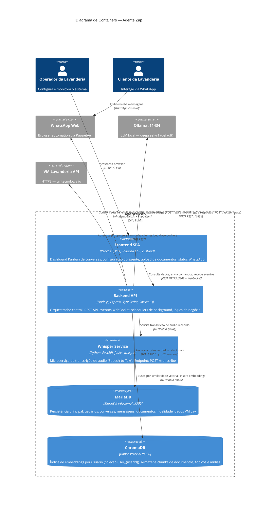

# C4 — Diagrama de Containers (Nível 2)

> Gerado pelo Arquiteto (Reversa) em 2026-05-16
> Referência: C4 Model — https://c4model.com

---

## Descrição

O diagrama de containers detalha os processos e datastores que compõem o **Agente Zap**, com tecnologias e protocolos de comunicação entre eles.

---

## Diagrama Mermaid

---

## Detalhamento dos Containers

### Frontend SPA (`frontend/`)

| Atributo | Valor |
|---------|-------|
| Tecnologia | React 18.2, Vite 5, Tailwind CSS 3.4, Zustand 4.4 |
| Porta | 3300 |
| Entry point | `frontend/src/main.tsx` |
| Roteamento | React Router (7 páginas: Login, Dashboard, AgentConfig, WhatsAppStatus, Documents, Medias, Indexing) |
| Estado global | Zustand (`authStore.ts`) — token JWT e dados do usuário |
| Comunicação | 13 services HTTP + Socket.IO client |

**Páginas principais:**
- **Dashboard** — Kanban de conversas em tempo real via Socket.IO
- **WhatsApp Status** — exibe QR code para conexão, status da sessão
- **Agent Config** — configura modelo LLM, textos do negócio, parâmetros
- **Documents** — upload e indexação de PDF/DOCX/TXT
- **Indexing** — controle do índice RAG no ChromaDB

---

### Backend API (`backend/`)

| Atributo | Valor |
|---------|-------|
| Tecnologia | Node.js, Express 4.18, TypeScript, Socket.IO 4.7 |
| Porta | 3302 |
| Entry point | `backend/src/index.ts` |
| Rotas | 13 Express Routers registrados em `/api/<módulo>` |
| Controllers | 14 controllers |
| Services | 17 services (lógica de negócio) |
| Models | 22+ models (acesso a dados) |
| Background jobs | 4 schedulers (conversas, WhatsApp health, VM Lav sync, fidelidade) |

**Módulos internos:** auth, whatsapp, conversation, document, agentConfig, media, topic, indexing (RAG), ollama, humanAttendant, vmLav, fidelizacao, testChat

---

### Whisper Service (`whisper-service/`)

| Atributo | Valor |
|---------|-------|
| Tecnologia | Python 3, FastAPI 0.115, faster-whisper 1.1 |
| Endpoint | `POST /transcribe` |
| Entrada | Arquivo de áudio (recebido do WhatsApp) |
| Saída | Texto transcrito |
| Inicialização | `start.bat` (Windows) / `start.sh` (Linux) |

---

### MariaDB (Banco Relacional)

| Atributo | Valor |
|---------|-------|
| Porta | 3306 |
| Driver | `mysql2/promise` com pool de conexões |
| Schema | `backend/src/config/database.schema.sql` |
| Migrations | 35 arquivos em `backend/src/config/migrations/` |
| Tabelas principais | users, whatsapp_sessions, conversations, messages, documents, document_chunks, medias, topics, agent_config, human_attendants, vm_lav_clientes, vm_lav_pedidos, vm_lav_credentials, premios, fidelizacao_regras, fidelizacao_notificacoes |

---

### ChromaDB (Banco Vetorial)

| Atributo | Valor |
|---------|-------|
| Porta | 8000 |
| Client | chromadb SDK 1.8.1 |
| Dados persistidos | `backend/chroma_db/` |
| Coleções | Uma por usuário: `user_{userId}` |
| Itens indexados | Chunks de documentos, tópicos, mídias |
| Uso | Busca semântica por embeddings (RAG) |

---

## Escala de Confiança

- 🟢 **CONFIRMADO** — tecnologias e conexões verificadas em package.json, código-fonte e inventário Scout
- 🟡 **INFERIDO** — alguns detalhes de comunicação Whisper↔Backend (endpoint exact não lido)
