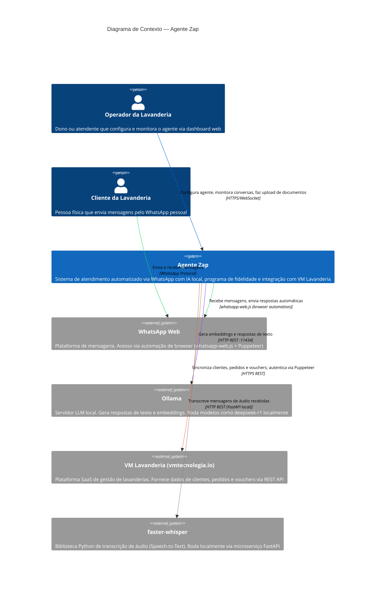

# C4 — Diagrama de Contexto (Nível 1)

> Gerado pelo Arquiteto (Reversa) em 2026-05-16
> Referência: C4 Model — https://c4model.com

---

## Descrição

O diagrama de contexto mostra o **Agente Zap** como sistema central, os usuários que interagem com ele e os sistemas externos com os quais se integra.

---

## Diagrama Mermaid

---

## Atores e Sistemas

### Usuários (Pessoas)

| Ator | Descrição | Canal de Acesso |
|------|-----------|----------------|
| **Operador da Lavanderia** | Dono ou funcionário que possui conta no Agente Zap. Configura o agente, faz upload de documentos, monitora conversas via dashboard Kanban e gerencia regras de fidelidade | Frontend web (HTTPS + WebSocket) |
| **Cliente da Lavanderia** | Pessoa física que entrega roupas na lavanderia e interage com o bot pelo WhatsApp pessoal. Não tem conta no Agente Zap | WhatsApp (via bot) |

### Sistemas Externos

| Sistema | Tipo | Protocolo | Observações |
|---------|------|-----------|-------------|
| **WhatsApp Web** | Plataforma de mensageria | Browser automation (Puppeteer) | Não é API oficial — usa `whatsapp-web.js` que emula o cliente web. Frágil a mudanças do WhatsApp. |
| **Ollama** | LLM local | HTTP REST :11434 | Roda localmente na mesma máquina. Modelos configuráveis (padrão: deepseek-r1). Responsável por embeddings E geração de texto. |
| **VM Lavanderia** | SaaS externo | HTTPS REST | Plataforma de gestão de lavanderias da vmtecnologia.io. Autenticação via scraping Puppeteer (captcha). URLs hardcoded. |
| **faster-whisper** | Biblioteca Python local | HTTP REST (FastAPI) | Transcrição de áudio Speech-to-Text. Roda localmente como microserviço separado. |

---

## Escala de Confiança

- 🟢 **CONFIRMADO** — todos os atores e integrações verificados no código-fonte
