# ERD Completo — WhatsappAgenteIA (Agente Zap)

> Gerado pelo Arquiteto (Reversa) em 2026-05-16
> Fonte: `backend/src/config/database.schema.sql`, models e dicionário de dados

---

## Diagrama ERD (Mermaid)

```mermaid
erDiagram

    %% ===================== CORE =====================

    users {
        int id PK
        varchar username UK
        varchar email UK
        varchar password_hash
        datetime created_at
        datetime updated_at
    }

    whatsapp_sessions {
        int id PK
        int user_id FK
        text session_data
        text qr_code
        enum status
        datetime last_connected_at
        datetime last_ready_at
        varchar session_files_path
        varchar session_files_hash
        datetime created_at
        datetime updated_at
    }

    conversations {
        int id PK
        int user_id FK
        varchar contact_number
        varchar contact_name
        varchar lid
        enum status
        tinyint auto_responding
        datetime last_message_at
        tinyint needs_intervention
        datetime intervention_resolved_at
        datetime created_at
        datetime updated_at
    }

    messages {
        int id PK
        int conversation_id FK
        varchar message_id
        text content
        enum message_type
        int media_id FK
        enum direction
        tinyint is_from_ai
        datetime received_at
        datetime read_at
        datetime created_at
    }

    reactions {
        int id PK
        varchar message_id
        varchar reaction_emoji
        varchar reacted_by
        datetime created_at
    }

    %% ===================== CONFIGURAÇÃO =====================

    agent_config {
        int id PK
        int user_id FK
        text business_name
        text business_info
        text services
        text hours
        text personality
        text greeting_message
        text farewell_message
        text absence_message
        text specific_instructions
        varchar embedding_model
        varchar generation_model
        float temperature
        float top_p
        int top_k
        float repeat_penalty
        int max_age_hours
        datetime last_indexed_at
        enum indexing_status
        varchar content_hash
    }

    %% ===================== CONTEÚDO / BASE DE CONHECIMENTO =====================

    documents {
        int id PK
        int user_id FK
        varchar filename
        varchar file_type
        varchar file_path
        int file_size
        enum status
        text error_message
    }

    document_chunks {
        int id PK
        int document_id FK
        text chunk_text
        int chunk_index
        text embedding
    }

    medias {
        int id PK
        int user_id FK
        varchar filename
        varchar file_path
        enum file_type
        enum source
        int file_size
        varchar title
        text description
        text caption
        tinyint is_active
        tinyint mandatory_send
        enum indexing_status
        varchar content_hash
    }

    media_sent_tracking {
        int id PK
        int conversation_id FK
        int media_id FK
        datetime sent_at
    }

    topics {
        int id PK
        int user_id FK
        varchar title
        text description
        json trigger_keywords
        enum context
        int priority
        tinyint is_active
        enum indexing_status
        varchar content_hash
    }

    %% ===================== ATENDIMENTO =====================

    human_attendants {
        int id PK
        int user_id FK
        varchar phone_number
        varchar name
        tinyint is_active
    }

    %% ===================== VM LAVANDERIA =====================

    vm_lav_credentials {
        int id PK
        int user_id FK
        varchar email
        varchar senha
        text token
        datetime token_expires_at
    }

    vm_lav_clientes {
        int id PK
        int user_id FK
        varchar nome
        varchar cpf
        varchar telefone
        varchar email
        date data_nascimento
        datetime data_ultima_compra
        datetime data_cadastro
        int qtd_compras
        decimal valor_total_compras
    }

    vm_lav_pedidos {
        int id PK
        int user_id FK
        varchar cliente_cpf
        varchar tipo_servico
        varchar situacao_venda
        datetime data_venda
        tinyint pago_com_fidelidade
    }

    vm_lav_vouchers {
        int id PK
        varchar id_voucher_vm
        int user_id FK
        varchar cliente_cpf
        text descricao
        datetime data_criacao
        datetime data_validade
        tinyint utilizado
    }

    vm_lav_sincronizacao_log {
        int id PK
        int user_id FK
        datetime iniciado_em
        datetime finalizado_em
        int clientes_sincronizados
        int pedidos_sincronizados
        varchar status
        text erro
    }

    %% ===================== FIDELIZAÇÃO =====================

    premios {
        int id PK
        int user_id FK
        varchar descricao
        int meta
        enum tipo_servico
        tinyint is_active
    }

    premios_clientes {
        int id PK
        int user_id FK
        varchar cliente_cpf
        int premio_id FK
        datetime data_conquista
        datetime data_validade
        tinyint utilizado
    }

    fidelizacao_tipos_gatilho {
        int id PK
        varchar nome
        varchar descricao
        tinyint is_active
    }

    fidelizacao_regras {
        int id PK
        int user_id FK
        int tipo_gatilho_id FK
        text template_mensagem
        tinyint is_ativo
        datetime vigencia_inicio
        datetime vigencia_fim
        json segmentacao_publico
        int intervalo_verificacao
    }

    fidelizacao_regras_config {
        int id PK
        int user_id FK
        tinyint ativo
        tinyint simulacao
        int max_mensagens_por_cliente_semana
        int max_mensagens_por_cliente_mes
    }

    fidelizacao_notificacoes {
        int id PK
        int user_id FK
        int regra_id FK
        varchar cliente_cpf
        varchar telefone
        text mensagem
        enum status
        int pedido_id
        datetime enviado_em
    }

    %% ===================== RELACIONAMENTOS =====================

    users ||--o{ whatsapp_sessions : "has 1"
    users ||--o{ conversations : "owns"
    users ||--|| agent_config : "has 1"
    users ||--o{ documents : "uploads"
    users ||--o{ medias : "manages"
    users ||--o{ topics : "creates"
    users ||--o{ human_attendants : "configures"
    users ||--o{ vm_lav_credentials : "has 1"
    users ||--o{ vm_lav_clientes : "syncs"
    users ||--o{ vm_lav_pedidos : "syncs"
    users ||--o{ vm_lav_vouchers : "issues"
    users ||--o{ vm_lav_sincronizacao_log : "logs"
    users ||--o{ premios : "defines"
    users ||--o{ fidelizacao_regras : "configures"
    users ||--|| fidelizacao_regras_config : "has 1"
    users ||--o{ fidelizacao_notificacoes : "sends"
    users ||--o{ premios_clientes : "grants"

    conversations ||--o{ messages : "contains"
    conversations ||--o{ media_sent_tracking : "tracks"

    messages }o--o| medias : "may attach"

    documents ||--o{ document_chunks : "splits into"

    premios ||--o{ premios_clientes : "granted as"

    fidelizacao_regras }o--|| fidelizacao_tipos_gatilho : "uses"
    fidelizacao_regras ||--o{ fidelizacao_notificacoes : "triggers"

    media_sent_tracking }o--|| medias : "tracks"
```



---

## Cardinalidades e Constraints

| Relacionamento | Cardinalidade | Constraint |
|---------------|--------------|-----------|
| `users` → `whatsapp_sessions` | 1:1 | `UNIQUE(user_id)` na tabela sessions |
| `users` → `agent_config` | 1:1 | `UNIQUE(user_id)` na tabela agent_config |
| `users` → `vm_lav_credentials` | 1:1 (🟡 inferido) | Sem constraint explícita identificada |
| `users` → `fidelizacao_regras_config` | 1:1 | `UNIQUE(user_id)` (🟡 inferido) |
| `users` → `conversations` | 1:N | FK user_id, sem limite |
| `conversations` → `messages` | 1:N | FK conversation_id |
| `documents` → `document_chunks` | 1:N | FK document_id |
| `premios` → `premios_clientes` | 1:N | FK premio_id |
| `fidelizacao_regras` → `fidelizacao_notificacoes` | 1:N | FK regra_id |

---

## Joins Especiais

### `conversations` JOIN `vm_lav_clientes`
```sql
LEFT JOIN vm_lav_clientes v
  ON normaliza_telefone(v.telefone) = normaliza_telefone(c.contact_number)
  AND v.user_id = c.user_id
```
Usa a função SQL customizada `normaliza_telefone()` para compatibilizar formatos (com/sem DDI, traço, parênteses). 🟢 CONFIRMADO

### `premios_clientes` JOIN `vm_lav_pedidos` (via CPF)
```sql
-- Joins usam CPF normalizado como chave de negócio entre tabelas
WHERE normalizaCpf(pc.cliente_cpf) = normalizaCpf(vp.cliente_cpf)
```
CPF funciona como chave estrangeira de negócio (não formal) entre entidades de fidelidade e pedidos VM Lav. 🟢 CONFIRMADO

---

## Escala de Confiança

- 🟢 **CONFIRMADO** — entidades, campos e relacionamentos extraídos do dicionário de dados e schema SQL
- 🟡 **INFERIDO** — alguns constraints 1:1 (vm_lav_credentials, fidelizacao_regras_config) sem constraint SQL explícita lida
