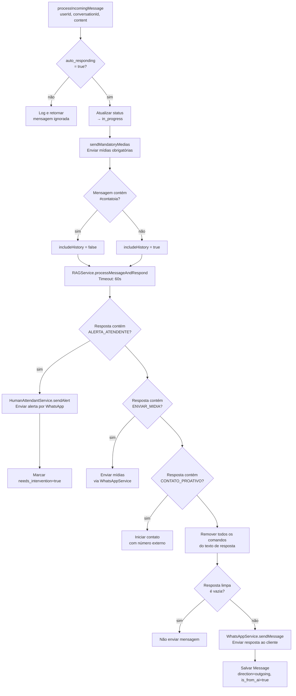
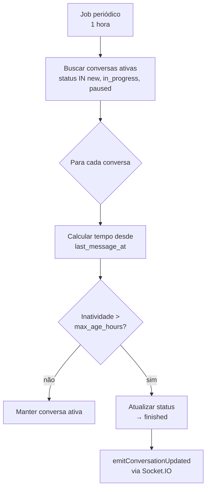
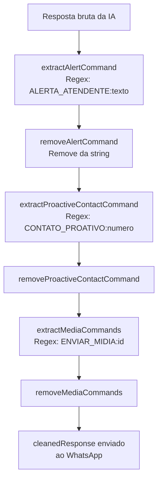

# Flowchart — Módulo `conversation`

> Gerado pelo Arqueólogo (Reversa) em 2026-05-16

## Fluxo: processIncomingMessage — Pipeline Principal da IA

## Fluxo: Finalização Automática de Conversas

## Fluxo: Extração de Comandos da Resposta da IA

