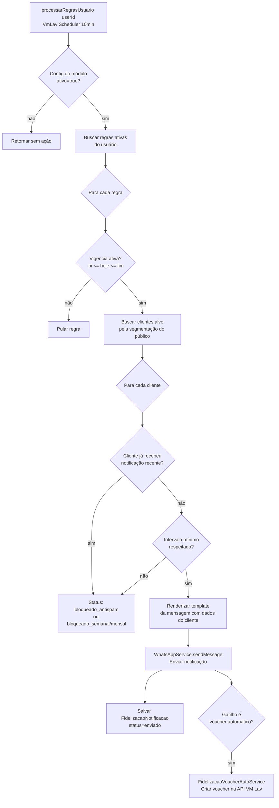
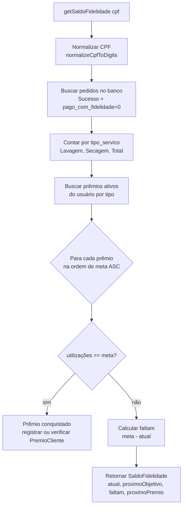
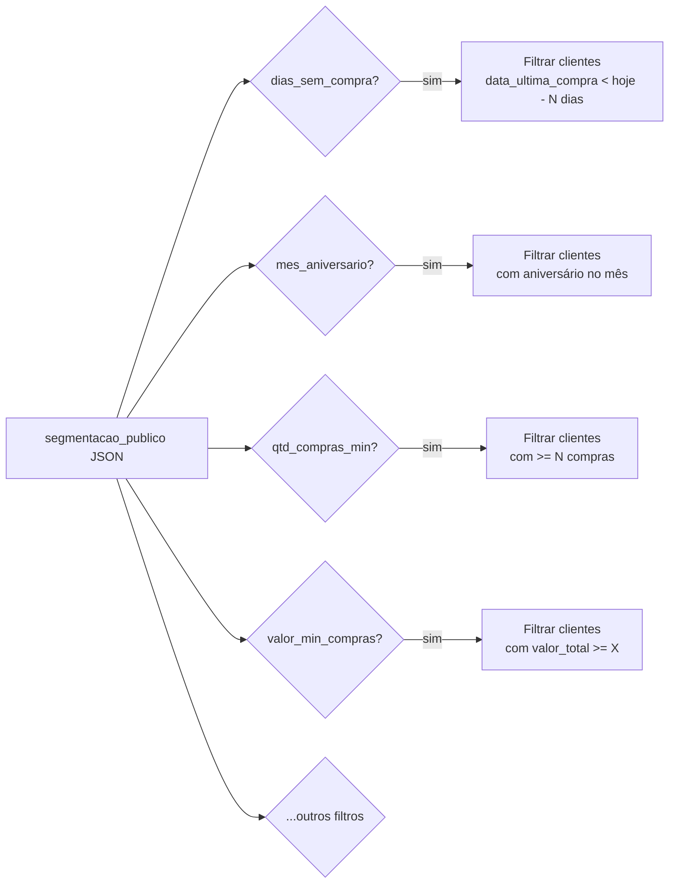

# Flowchart — Módulo `fidelizacao`

> Gerado pelo Arqueólogo (Reversa) em 2026-05-16

## Fluxo: Motor de Disparo de Regras

## Fluxo: Cálculo de Saldo de Fidelidade

## Segmentação de Público — Filtros disponíveis

