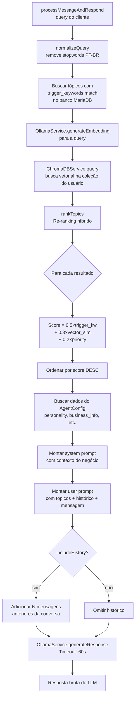
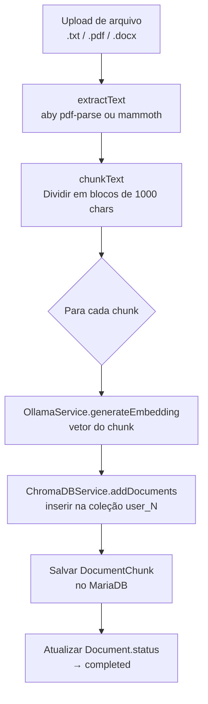

# Flowchart — Módulo `indexing` (RAG)

> Gerado pelo Arqueólogo (Reversa) em 2026-05-16

## Fluxo: Busca Híbrida (RAGService)



## Fluxo: Indexação de Documento



## Fórmula de Score — Re-ranking

```
Score = (TRIGGER_KW_WEIGHT × hasTriggerKeyword)
      + (VECTOR_SIM_WEIGHT × (1 - min(distance, 1)))
      + (PRIORITY_WEIGHT × min(priority/100, 1))

Onde:
  TRIGGER_KW_WEIGHT = 0.5
  VECTOR_SIM_WEIGHT = 0.3
  PRIORITY_WEIGHT   = 0.2
  MAX_DISTANCE_THRESHOLD = 0.8
```
