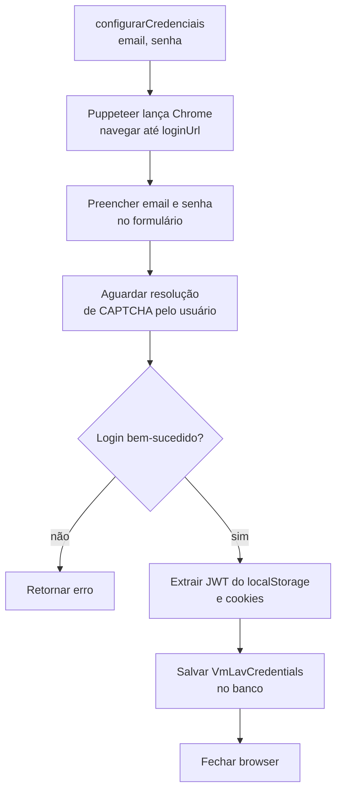
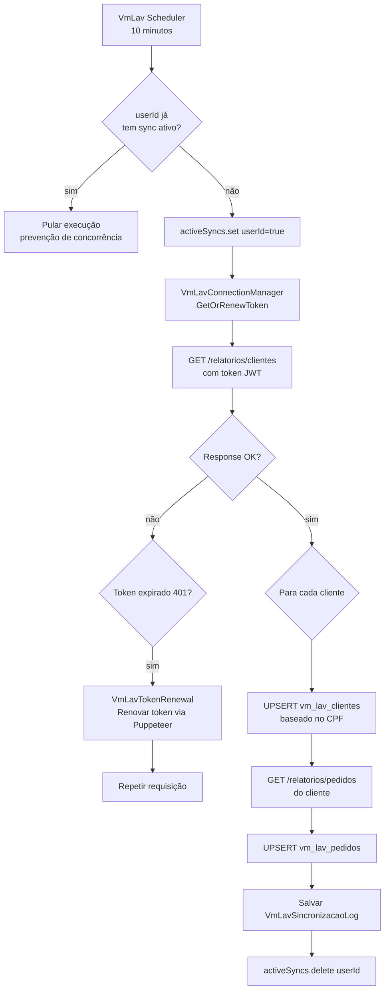
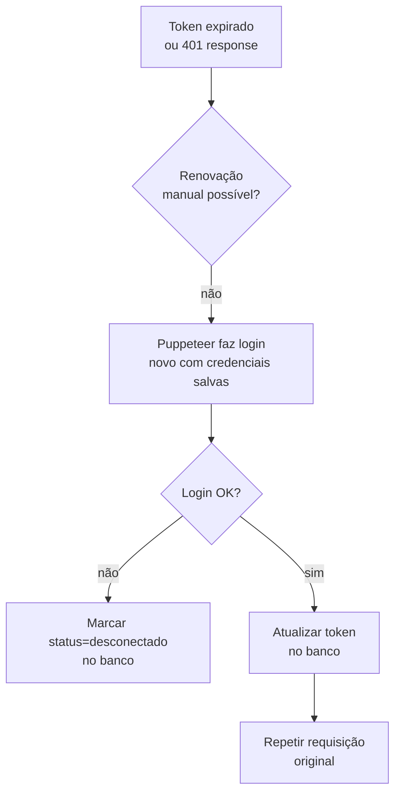

# Flowchart — Módulo `vmLav`

> Gerado pelo Arqueólogo (Reversa) em 2026-05-16

## Fluxo: Configuração de Credenciais (Login Puppeteer)

## Fluxo: Sincronização de Clientes e Pedidos

## Fluxo: Renovação de Token (VmLavConnectionManager)

