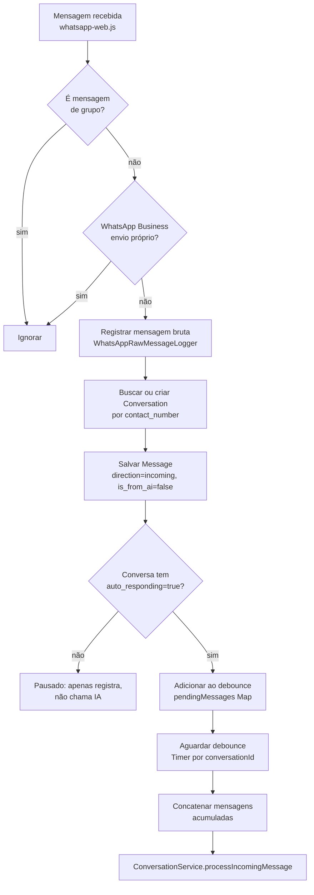
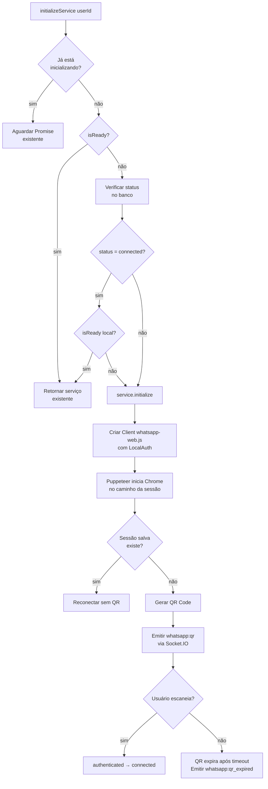
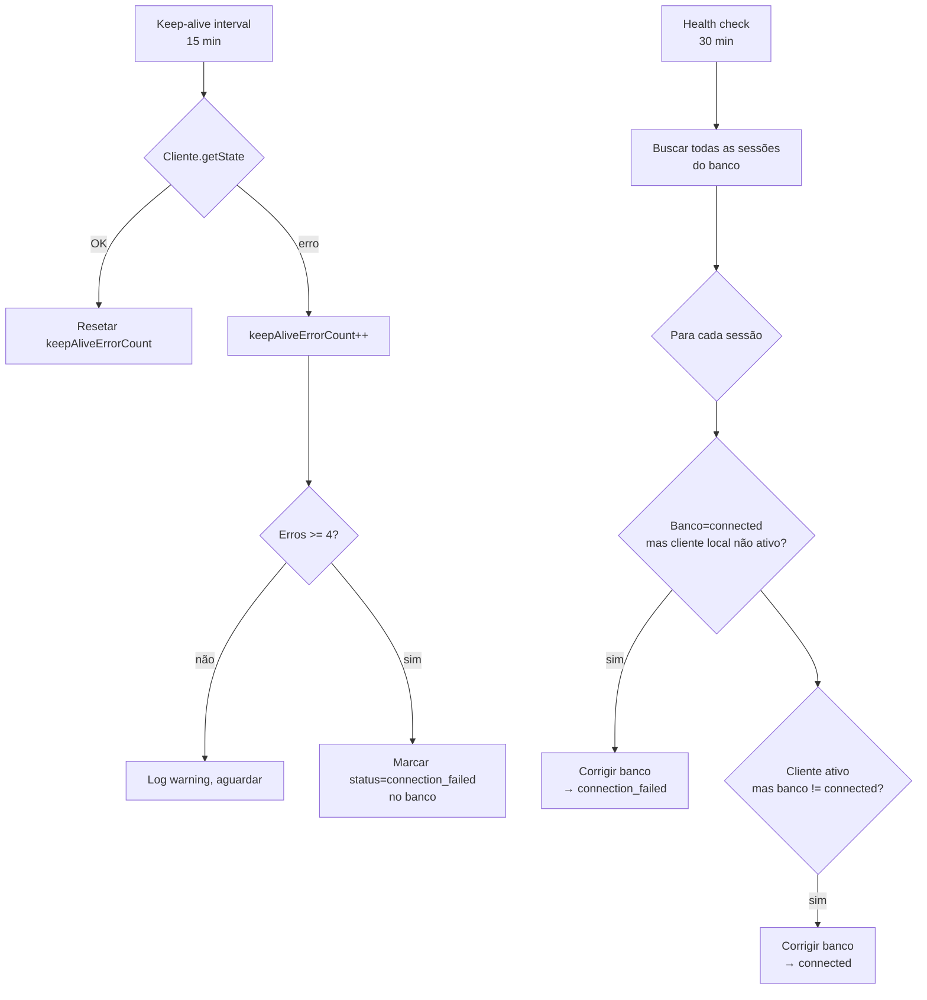

# Flowchart — Módulo `whatsapp`

> Gerado pelo Arqueólogo (Reversa) em 2026-05-16

## Fluxo: Recebimento de Mensagem WhatsApp

## Fluxo: Inicialização da Sessão WhatsApp

## Fluxo: Keep-Alive e Health Check

