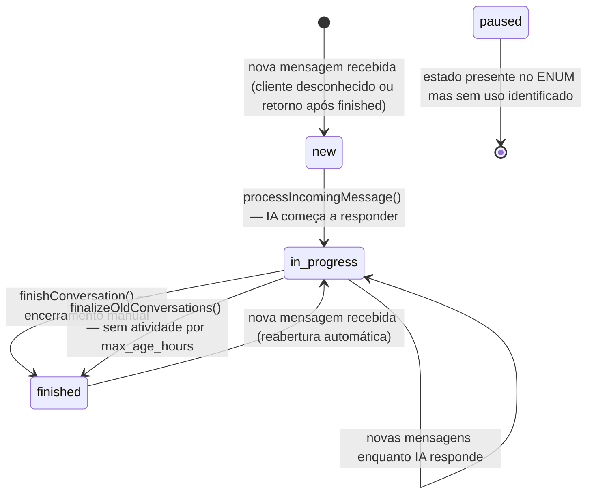
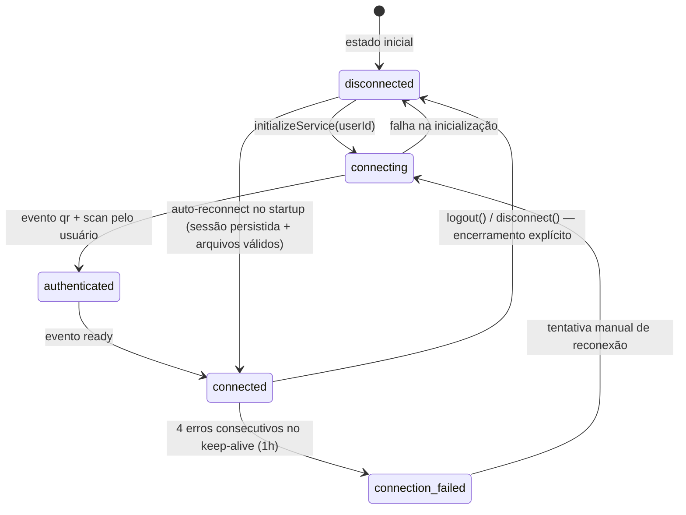
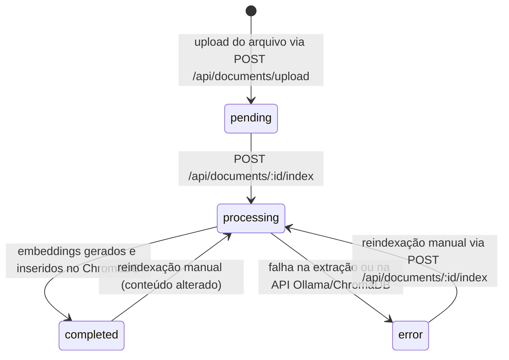
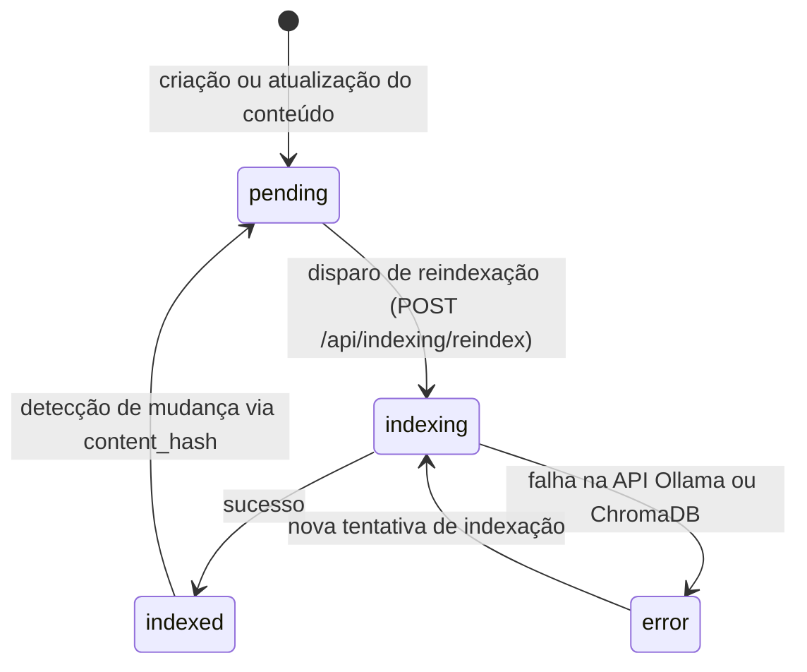
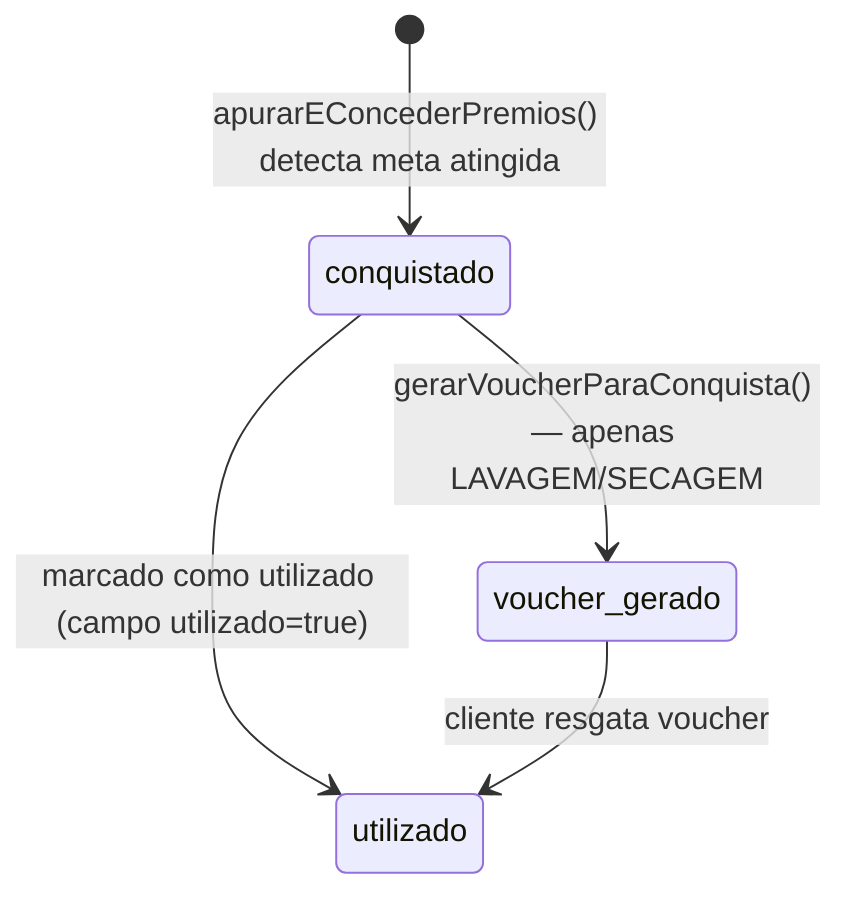

# Máquinas de Estado — WhatsappAgenteIA (Agente Zap)

> Gerado pelo Detetive (Reversa) em 2026-05-16
> Nível de documentação: Completo

---

## 1. Conversa (`conversations.status`)

🟢 CONFIRMADO — extraído de `conversation.service.ts` e `data-dictionary.md`

### Estados

| Estado | Significado |
|--------|-------------|
| `new` | Conversa criada, ainda sem processamento ativo |
| `in_progress` | Conversa sendo atendida (IA ou humano) |
| `paused` | 🔴 LACUNA — estado existe no ENUM mas sem transições identificadas no código atual |
| `finished` | Conversa encerrada (manualmente ou por timeout automático) |

### Diagrama



### Invariantes
- `finished` sempre reseta `auto_responding=true` para que a IA retome na próxima interação
- A transição `finished → in_progress` ocorre quando o cliente envia nova mensagem e o status é atualizado pelo `processIncomingMessage()`
- O estado `paused` existe no schema SQL mas não tem gatilhos de entrada/saída identificados — 🔴 LACUNA

### Flag ortogonal: `auto_responding` + `needs_intervention`

O status da conversa coexiste com duas flags independentes:

| Flag | Tipo | Significado |
|------|------|-------------|
| `auto_responding` | boolean | Se `false`, IA ignora mensagens recebidas |
| `needs_intervention` | boolean | Se `true`, IA sinalizou necessidade de atendente humano |

```
status=in_progress + auto_responding=false → atendente humano assumiu a conversa
status=in_progress + needs_intervention=true → aguardando resolução humana
```

---

## 2. Sessão WhatsApp (`whatsapp_sessions.status`)

🟢 CONFIRMADO — extraído de `whatsapp.service.ts`, `code-analysis.md` e `add_connection_failed_status.sql`

### Estados

| Estado | Significado |
|--------|-------------|
| `disconnected` | Sessão inativa, sem cliente WhatsApp instanciado |
| `connecting` | Processo de inicialização em andamento |
| `authenticated` | QR code escaneado, autenticação concluída |
| `connected` | Cliente WhatsApp pronto para enviar/receber |
| `connection_failed` | 4 falhas consecutivas no keep-alive (≈1h sem conexão) |

### Diagrama



### Mecanismos de resiliência

| Mecanismo | Intervalo | Ação |
|-----------|-----------|------|
| Keep-alive | 15 min | Verifica se cliente responde; após 4 falhas → `connection_failed` |
| Health check | 30 min | Compara status banco vs. estado real do cliente em memória |
| QR expiry | sob demanda | Limpa `lastQRCode`, emite evento `qr_expired` via Socket.IO |
| Auto-reconnect | startup | Escaneia sessões do banco, valida hash dos arquivos LocalAuth |

---

## 3. Documento (`documents.status`)

🟢 CONFIRMADO — extraído de `data-dictionary.md` e `document.service.ts`

### Estados

| Estado | Significado |
|--------|-------------|
| `pending` | Arquivo enviado, aguardando indexação |
| `processing` | Extração de texto e geração de embeddings em andamento |
| `completed` | Documento indexado com sucesso no ChromaDB |
| `error` | Falha durante extração ou indexação |

### Diagrama



---

## 4. Status de Indexação (Mídia / Tópico / AgentConfig)

🟢 CONFIRMADO — campo `indexing_status` presente em `medias`, `topics` e `agent_config`

### Estados (compartilhados pelos três tipos)

| Estado | Significado |
|--------|-------------|
| `pending` | Conteúdo aguardando indexação |
| `indexing` | Processamento em andamento |
| `indexed` | Indexado com sucesso no ChromaDB |
| `error` | Falha durante indexação |

### Diagrama



### Detecção de mudança
O campo `content_hash` armazena hash do conteúdo indexado. Se o conteúdo for alterado, o hash muda e o status retorna para `pending`, forçando reindexação.

---

## 5. Prêmio de Fidelidade (tipo de atingimento)

🟢 CONFIRMADO — extraído de `fidelizacao.service.ts`

Esta não é uma máquina de estado em sentido estrito, mas um **modo de comportamento** que define como as conquistas são contadas.

| Tipo | Comportamento | Conquistas |
|------|--------------|-----------|
| `UNICO` | Concedido apenas uma vez. Após a primeira conquista, é ignorado nas verificações subsequentes. | 0 ou 1 |
| `PERPETUO` | Pode ser concedido ilimitadas vezes. A cada ciclo, as utilizações já usadas são subtraídas (utilizações_total - meta × conquistas_anteriores). | 0..N |

### Estado de um Prêmio Conquistado (`premios_clientes`)



---

## 6. Notificação de Automação (`fidelizacao_notificacoes`)

🟡 INFERIDO — sem ENUM explícito, comportamento inferido do `FidelizacaoRegrasService`

| Estado | Evidência |
|--------|-----------|
| `enviado_whatsapp=true` | Mensagem efetivamente enviada pelo WhatsApp |
| `enviado_whatsapp=false + erro=null` | Modo simulação — registrado mas não enviado |
| `enviado_whatsapp=false + erro!=null` | Falha de envio (WhatsApp não estava pronto ou erro na API) |

---

## Resumo de Entidades com Estado

| Entidade | Campo | Estados | Máquina definida |
|---------|-------|---------|-----------------|
| `conversations` | `status` | new, in_progress, paused, finished | ✅ (ver seção 1) |
| `whatsapp_sessions` | `status` | disconnected, connecting, authenticated, connected, connection_failed | ✅ (ver seção 2) |
| `documents` | `status` | pending, processing, completed, error | ✅ (ver seção 3) |
| `medias` | `indexing_status` | pending, indexing, indexed, error | ✅ (ver seção 4) |
| `topics` | `indexing_status` | pending, indexing, indexed, error | ✅ (ver seção 4) |
| `agent_config` | `indexing_status` | pending, indexing, indexed, error | ✅ (ver seção 4) |
| `premios_clientes` | `utilizado` (boolean) | false → true | ✅ (ver seção 5) |
| `fidelizacao_regras` | `ativo` (boolean) | false ↔ true | 🟡 simples |
| `fidelizacao_regras_config` | `simulacao` (boolean) | true → false | 🟡 simples |
